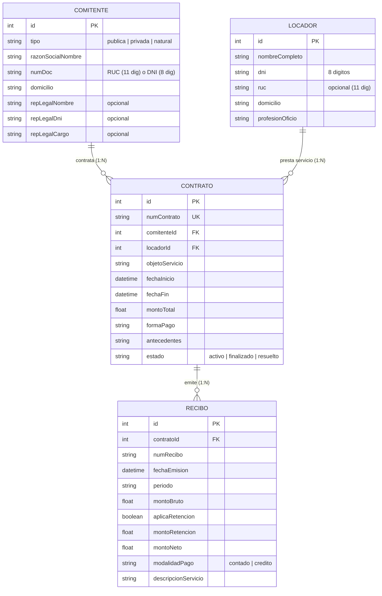

# Sistema de Locación de Servicios y Honorarios - Perú

Sistema web para la generación automática de Contratos de Locación de Servicios civiles (Art. 1764-1770 del Código Civil del Perú) y el detalle mensual de Recibos por Honorarios con cálculo automático de retención del 8% de Impuesto a la Renta.

## Stack Tecnológico

- **Backend / API**: Node.js + Express + TypeScript + Zod
- **Base de Datos**: SQLite + Prisma ORM
- **Frontend**: React + Vite + TypeScript + Tailwind CSS
- **Generación de Documentos**: docxtemplater (.docx)
- **CI/CD**: GitHub Actions
- **Testing**: Vitest + Supertest

## Estado del Proyecto

`Sprint 1 - Modelo de datos & API REST completados` 🚀

---

## Modelo de Datos

El sistema consta de 4 entidades principales relacionadas en SQLite mediante Prisma ORM:



---

## Cómo ejecutar localmente

### 1. Clonar el repositorio

```bash
git clone https://github.com/Systems-Engineer-01/locacion-honorarios-pe.git
cd locacion-honorarios-pe
```

### 2. Backend (API)

```bash
cd backend
npm install
npx prisma db push
npm run dev
```

El servidor backend estará disponible en `http://localhost:5000` (Endpoint de verificación: `http://localhost:5000/health`).

### 3. Frontend (UI)

En una nueva terminal:

```bash
cd frontend
npm install
npm run dev
```

La aplicación web estará disponible en `http://localhost:5173`.

---

## Scripts Disponibles

### Backend (`/backend`)
- `npm run dev`: Inicia el servidor en modo desarrollo con recarga en vivo (`tsx`).
- `npm run build`: Compila TypeScript a JavaScript en `/dist`.
- `npm run lint`: Ejecuta ESLint.
- `npm test`: Ejecuta las pruebas unitarias e integración con Vitest.
- `npm run format`: Formatea el código con Prettier.

### Frontend (`/frontend`)
- `npm run dev`: Inicia el servidor de desarrollo Vite.
- `npm run build`: Compila la aplicación para producción.
- `npm run lint`: Ejecuta ESLint.
- `npm run preview`: Previsualiza el build de producción.