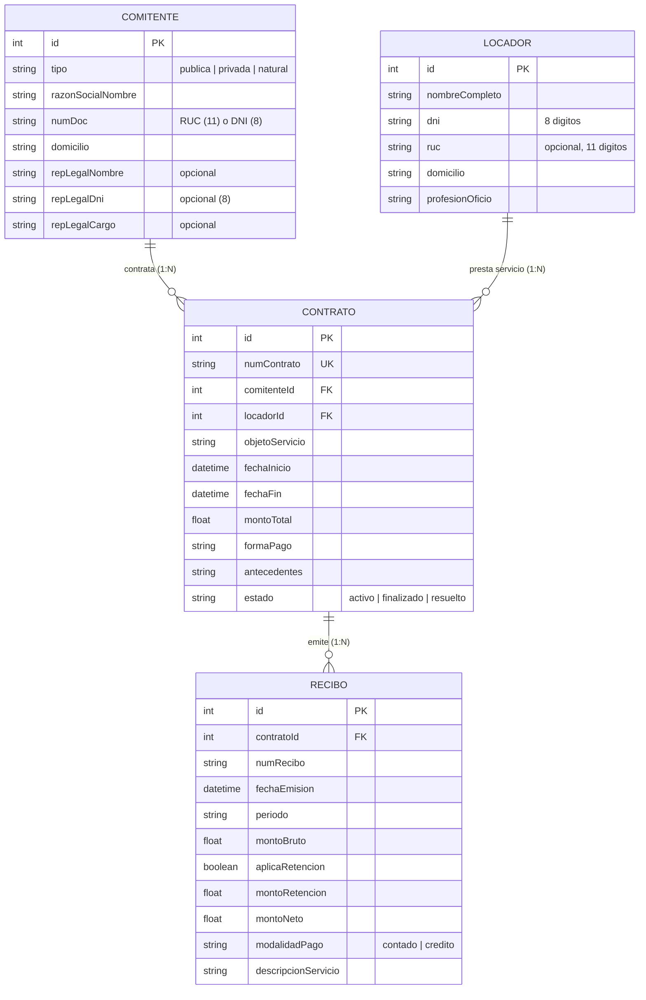

# Plan de Implementación — Sprint 1: Modelo de Datos & CRUD API

Este plan detalla la creación del modelo de datos con **Prisma ORM (SQLite)**, la implementación de validaciones estricta de entradas con **Zod**, los controladores y rutas REST para **Comitente, Locador, Contrato y Recibo**, así como pruebas unitarias con **Vitest** y documentación API.

---

## 1. Modelo de Datos (`backend/prisma/schema.prisma`)

Definición de las 4 entidades principales y sus relaciones 1-N:

---

## 2. Cambios Propuestos

### Backend (`/backend`)

#### Schema & Migración (`backend/prisma/schema.prisma`)
- [MODIFY] [schema.prisma](file:///c:/locacion-honorarios-pe/backend/prisma/schema.prisma) — Definir modelos `Comitente`, `Locador`, `Contrato`, `Recibo` y enums/campos relacionales.
- Ejecutar `npx prisma db push` / `npx prisma generate`.

#### Esquemas de Validación Zod (`backend/src/validators/`)
- [NEW] [comitente.schema.ts](file:///c:/locacion-honorarios-pe/backend/src/validators/comitente.schema.ts) — Validar RUC (11 dígitos), DNI (8 dígitos), tipo (`publica` | `privada` | `natural`) y representante legal según tipo.
- [NEW] [locador.schema.ts](file:///c:/locacion-honorarios-pe/backend/src/validators/locador.schema.ts) — Validar DNI (8 dígitos), RUC opcional (11 dígitos) y campos obligatorios.
- [NEW] [contrato.schema.ts](file:///c:/locacion-honorarios-pe/backend/src/validators/contrato.schema.ts) — Validar `montoTotal` (> 0), IDs existentes y formato de fechas.
- [NEW] [recibo.schema.ts](file:///c:/locacion-honorarios-pe/backend/src/validators/recibo.schema.ts) — Validar `montoBruto` (> 0), `modalidadPago` (`contado` | `credito`).

#### Rutas REST (`backend/src/routes/`)
- [NEW] [comitentes.ts](file:///c:/locacion-honorarios-pe/backend/src/routes/comitentes.ts) — GET `/api/comitentes`, GET `/:id`, POST, PUT `/:id`, DELETE `/:id`.
- [NEW] [locadores.ts](file:///c:/locacion-honorarios-pe/backend/src/routes/locadores.ts) — GET `/api/locadores`, GET `/:id`, POST, PUT `/:id`, DELETE `/:id`.
- [NEW] [contratos.ts](file:///c:/locacion-honorarios-pe/backend/src/routes/contratos.ts) — CRUD completo para `/api/contratos` (POST valida existencia de `comitenteId` y `locadorId` devolviendo HTTP 400/404 en caso contrario).
- [NEW] [recibos.ts](file:///c:/locacion-honorarios-pe/backend/src/routes/recibos.ts) — GET `/api/contratos/:id/recibos` y POST `/api/contratos/:id/recibos`.
- [MODIFY] [index.ts](file:///c:/locacion-honorarios-pe/backend/src/index.ts) — Registrar las rutas `/api/comitentes`, `/api/locadores`, `/api/contratos`.

#### Pruebas Unitarias & Integración (`backend/src/__tests__/`)
- Configurar **Vitest** + **supertest**.
- [NEW] [comitentes.test.ts](file:///c:/locacion-honorarios-pe/backend/src/__tests__/comitentes.test.ts) — Prueba de creación válida y rechazo por RUC inválido.
- [NEW] [contratos.test.ts](file:///c:/locacion-honorarios-pe/backend/src/__tests__/contratos.test.ts) — Prueba de rechazo de creación de contrato con locador inexistente.

---

### Documentación (`/docs` & `README.md`)
- [NEW] [api.md](file:///c:/locacion-honorarios-pe/docs/api.md) — Tabla completa de endpoints (método, ruta, body esperado, respuestas HTTP y códigos de estado).
- [MODIFY] [README.md](file:///c:/locacion-honorarios-pe/README.md) — Añadir sección "Modelo de datos" con diagrama Mermaid/ASCII.

---

## 3. Plan de Verificación

### Pruebas Automatizadas
- Instalar `vitest`, `supertest`, `@types/supertest`, `zod`.
- Ejecutar `npm run test` en `/backend`.
- Ejecutar `npm run lint` y `npm run build` en `/backend`.

### Flujo Git
- Crear rama: `git checkout -b feature/backend-modelo-datos`
- Realizar commit y push a origin `feature/backend-modelo-datos`.
- Generar la confirmación y PR.
